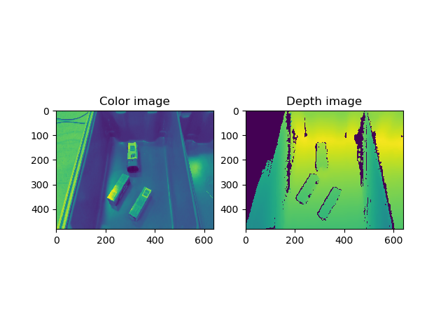
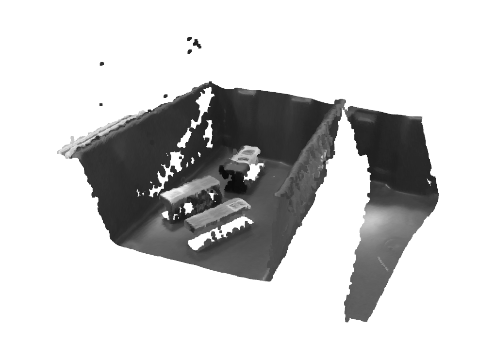
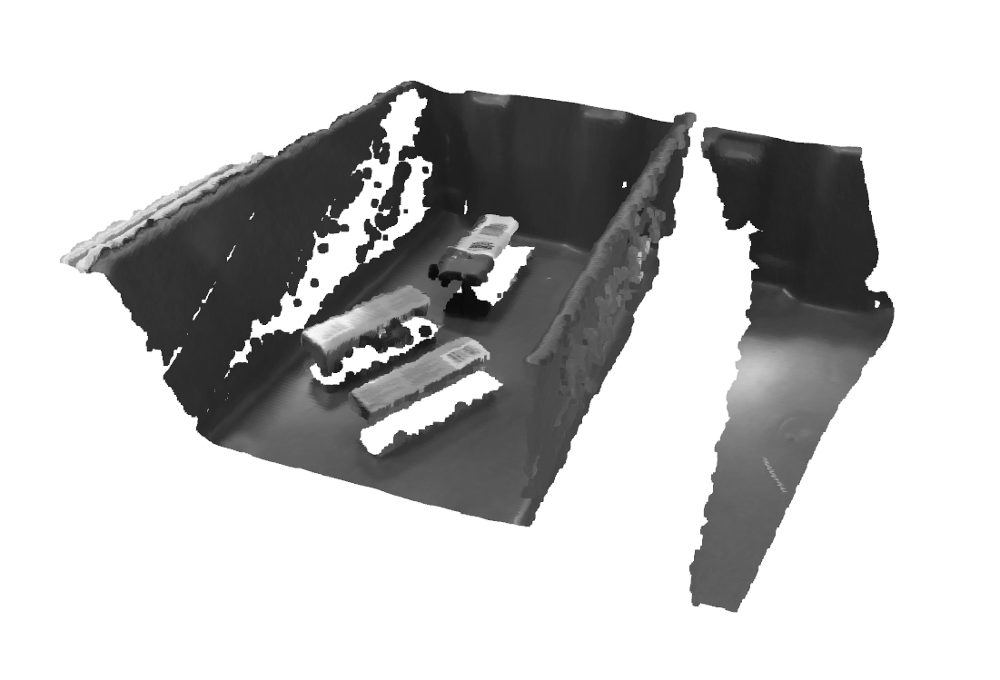
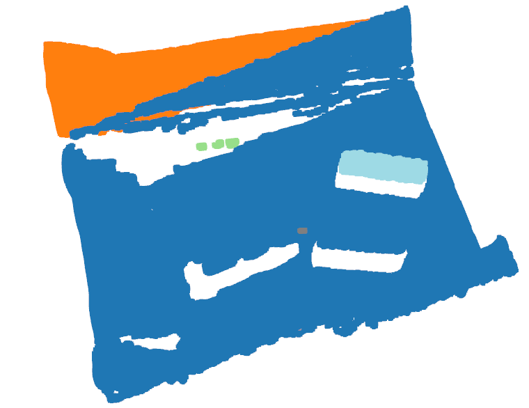

# RGBD_to_pointcloud
Tutorial on how to convert RGBD into pointcloud using Open3d library.

## Dataset
 Dataset can be found [here](https://3dvision.princeton.edu/projects/2017/arc/#datasets).
 The tutorial on RGBD to pointcloud is using the parallel-jaw-grasping-dataset for grasping tasks.
 The format of the data should be as follows:
 ```plain
└── DATA_DIR
       ├── rgb
       |   ├── 00000.png
       |   ├── 00001.png
       |   └── ...
       └── depth
       |   ├── 00000.png
       |   ├── 00001.png
       |   └── ...
       └── intrinsic
       |   ├── 00000.txt
       |   ├── 00001.txt
       |   └── ...
       └── extrinsic
       |   ├── 00000.png
       |   ├── 00001.png
       |   └── ...
```
## Run script

To run the RGBD to point cloud transformation, the command below should be executed:
```bash
python script.py --path_to_data [DATA_DIR] --filename [name_of_file]
```

## Results
Results for rgbd to pointcloud transformation:


Results for pointcloud filtering and noise removal:

Results for clustering pointcloud:
